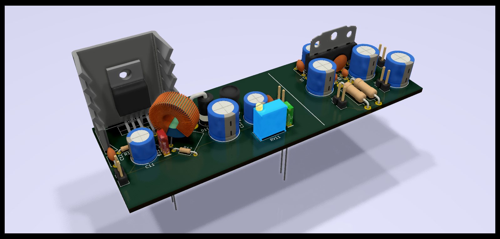

# [amplifeuer](https://lfs.nabijaczleweli.xyz/0017-twitter-export#1155789898718355456) 
An application of the TDA1521A, and also a boost circuit with an LT1071 because I'm a dumbass

## Schematic

## Layout

## Model

## Special thanks

To all who support further development on Patreon, in particular:

  * ThePhD
